# ElderCare — Progress

A snapshot of what is actually built, not what was planned. Built from the repository itself, not from memory of intent: `git log --all --graph`, the three remote branches (`main`, `feature/emergency`, `feature/caregiver` — `feature/screens`, Teammate C's branch per `WORK_DIVISION.md`, does not exist on `origin`), the working tree (`backend/caregiver/` is a bare `.gitkeep`; `frontend/src/caregiver/screens/CaregiverHomeScreen.js` and `frontend/src/shared/screens/LoginScreen.js` are explicit placeholders), and every entry in `BUILD_LOG.md`. Phase and step numbering follows `WORK_DIVISION.md` section 8.

Where `BUILD_LOG.md` and the code disagree about how finished something is, this favors whichever is more conservative — see the notes under the diagram.

```mermaid
flowchart TD
    classDef verified fill:#d4edda,stroke:#28a745,stroke-width:2px,color:#155724;
    classDef unverified fill:#fff3cd,stroke:#e0a800,stroke-width:2px,color:#7a5b00,stroke-dasharray:5 3;
    classDef inprogress fill:#cfe2ff,stroke:#0d6efd,stroke-width:2px,color:#052c65;
    classDef notstarted fill:#f1f3f5,stroke:#868e96,stroke-width:1px,color:#495057,stroke-dasharray:2 2;
    classDef unknown fill:#f1f3f5,stroke:#868e96,stroke-width:1px,color:#495057,stroke-dasharray:1 4;
    classDef notestyle fill:#ffffff,stroke:#ced4da,stroke-width:1px,color:#495057,font-style:italic;

    subgraph LEGEND["Legend"]
        direction LR
        L1["✅ Done — verified<br/>confirmed working, incl.<br/>on a real device where relevant"]:::verified
        L2["🧪 Done — unverified<br/>code/build complete,<br/>not yet confirmed working"]:::unverified
        L3["🔧 In progress"]:::inprogress
        L4["⬜ Not started"]:::notstarted
        L5["❔ Unknown<br/>teammate-owned, repo gives<br/>no signal either way"]:::unknown
    end

    subgraph P0["PHASE 0 — Foundation (Sree + Teammate C)"]
        direction TB
        P0_1["0.1 Database schema<br/>19 tables, 17 enum types<br/>✅ Done — verified"]:::verified
        P0_2["0.2 Backend server + DB pool<br/>✅ Done — verified"]:::verified
        P0_3["0.3 Auth & user roles<br/>register/login/refresh/logout, JWT<br/>✅ Done — verified"]:::verified
        P0_4["0.4 Expo app shell<br/>role-based routing<br/>🧪 Done — unverified<br/>on-device check never formally<br/>closed in BUILD_LOG's Open Issues"]:::unverified
        P0_5["0.5 Login & registration screens<br/>Owner: Teammate C<br/>⬜ Not started<br/>placeholder file in repo;<br/>no feature/screens branch on origin"]:::notstarted
        P0_6["0.6 API contract (API.md)<br/>✅ Done — verified<br/>kept current through Phase 1"]:::verified

        P0_1 --> P0_2 --> P0_3
        P0_3 --> P0_4 --> P0_5
        P0_3 --> P0_6
    end

    subgraph P1["PHASE 1 — Emergency Core (Sree) — complete, verified on real devices"]
        direction TB
        P1_1["1.1 SOS button + alert record<br/>countdown, cancel, resolve,<br/>family alert dashboard<br/>✅ Done — verified"]:::verified
        P1_2["1.2 GPS location capture<br/>permission flow, POST /emergency/locations,<br/>location captured at SOS press<br/>✅ Done — verified"]:::verified
        P1_3["1.3 Emergency contact notification<br/>+ escalation — SMS/call/push, scheduler<br/>✅ Done — verified"]:::verified

        P1_1 --> P1_2 --> P1_3
    end

    subgraph P2["PHASE 2 — Caregiver Core (Teammate B)"]
        direction TB
        P2_1["2.1 Caregiver profiles & search<br/>⬜ Not started"]:::notstarted
        P2_2["2.2 Caregiver booking<br/>⬜ Not started"]:::notstarted
        P2_3["2.3 Scheduling<br/>⬜ Not started"]:::notstarted
        P2_4["2.4 Attendance tracking<br/>⬜ Not started"]:::notstarted
        P2_note["backend/caregiver/ = .gitkeep only.<br/>Frontend caregiver screen = placeholder.<br/>feature/caregiver's only unique commit<br/>was an unrelated Vite scaffold,<br/>later deleted as scope creep."]:::notestyle

        P2_1 --> P2_2 --> P2_3 --> P2_4
        P2_4 -.-> P2_note
    end

    subgraph P3["PHASE 3 — Safety Layer (Sree)"]
        direction TB
        P3_1["3.1 Dev build<br/>custom dev client, off Expo Go<br/>✅ Done — verified<br/>config confirmed via expo config;<br/>APK built and actually used"]:::verified
        P3_2["3.2 Background location tracking<br/>TaskManager task, offline queue,<br/>on/off UI, permission flow<br/>🧪 Done — unverified<br/>BUILD_LOG's last word is 'not verified<br/>by me — needs the phone', never formally<br/>closed — though real GPS rows in the<br/>dev DB show it ran on a device at least once"]:::unverified
        P3_2a["3.2a Location dedup fix (2026-08-17)<br/>source column populated,<br/>UNIQUE constraint + ON CONFLICT,<br/>preview build 63d6c3c9<br/>🧪 Done — unverified<br/>preview APK built clean,<br/>not yet installed/run on a device"]:::unverified
        P3_3["3.3 Geofencing<br/>safe zones, breach detection<br/>⬜ Not started — no geofencing<br/>code anywhere in the repo"]:::notstarted
        P3_4["3.4 Real-time layer (WebSocket)<br/>⬜ Not started"]:::notstarted
        P3_5["3.5 Family live map & safety dashboard<br/>⬜ Not started<br/>react-native-maps deliberately not<br/>installed yet — needs a Google Maps<br/>API key decision first"]:::notstarted

        P3_1 --> P3_2 --> P3_2a --> P3_3 --> P3_4 --> P3_5
    end

    subgraph P4["PHASE 4 — Caregiver Depth (Teammate B)"]
        direction TB
        P4_1["4.1 Care plan management<br/>⬜ Not started"]:::notstarted
        P4_2["4.2 Daily activity reports<br/>⬜ Not started"]:::notstarted
        P4_3["4.3 Task assignment<br/>⬜ Not started"]:::notstarted
        P4_4["4.4 Ratings & reviews<br/>⬜ Not started"]:::notstarted

        P4_1 --> P4_2 --> P4_3 --> P4_4
    end

    subgraph P5["PHASE 5 — Emergency Response Services (Teammate C)"]
        direction TB
        P5_1["5.1 Ambulance booking<br/>⬜ Not started"]:::notstarted
        P5_2["5.2 Disaster alerts<br/>⬜ Not started"]:::notstarted
        P5_3["5.3 24/7 response center<br/>⬜ Not started"]:::notstarted
        P5_4["5.4 Fall detection (manual trigger)<br/>⬜ Not started"]:::notstarted
        P5_note["No ambulance / disaster / response-center /<br/>fall-detection code anywhere in the repo.<br/>No feature/screens branch exists on origin."]:::notestyle

        P5_1 --> P5_2 --> P5_3 --> P5_4
        P5_4 -.-> P5_note
    end

    subgraph P6["PHASE 6 — Polish & Delivery (All three)"]
        direction TB
        P6_1["6.1 Accessible design<br/>⬜ Not started"]:::notstarted
        P6_2["6.2 Location retention purge<br/>Owner: Sree<br/>⬜ Not started — open issue,<br/>locations table grows unbounded<br/>until this runs"]:::notstarted
        P6_3["6.3 Testing across main flows<br/>⬜ Not started"]:::notstarted
        P6_4["6.4 Final demo build<br/>⬜ Not started"]:::notstarted
        P6_5["6.5 Handover documentation<br/>⬜ Not started"]:::notstarted

        P6_1 --> P6_2 --> P6_3 --> P6_4 --> P6_5
    end

    P0_6 --> P1_1
    P0_6 --> P2_1
    P0_6 --> P5_1
    P1_3 --> P3_1
    P3_5 --> P6_1
    P2_4 --> P4_1
    P4_4 --> P6_1
    P5_4 --> P6_1
```

## Notes on judgment calls

- **0.4 Expo app shell — marked unverified, not verified.** `BUILD_LOG.md`'s "Open issues" section lists "the app shell is unverified on a real device" and never marks it closed the way it explicitly closes the phone-normalization and cancel-permission questions. In practice, Phase 1's on-device SOS testing almost certainly exercised login, token storage and role routing too — you can't press a real SOS button without the shell having gotten you there first — but since `BUILD_LOG.md` never says so directly, this stays unverified rather than assumed.
- **3.1 Dev build — marked verified.** Unlike 3.2, there's direct evidence beyond the config: the location rows examined during today's dedup fix are real GPS readings, which only exist because a dev-build APK was installed and ran the background task on an actual device.
- **3.2 Background location tracking — marked unverified**, matching `BUILD_LOG.md`'s own last word on it ("Not verified by me — needs the phone"), even though the duplicate-data investigation is itself indirect proof the task ran on a device at least once. No later entry closes that verification explicitly, so this stays conservative.
- **Phase 2, Phase 4, Phase 5, and step 0.5 — all "Not started," not "Unknown."** The instruction was to mark teammate-owned work "Unknown" only if the repo gives no signal. Here the repo gives a clear signal: `.gitkeep`-only folders, screens explicitly commented as placeholders, no matching backend routes mounted in `app.js`, and no `feature/screens` branch on `origin` at all. `feature/caregiver`'s only commit unique to that branch (`2c5a24e`) turned out to be an unrelated Vite web scaffold — merged into `main`, then deleted as scope creep per the 2026-08-14 "Merge conflict" entry in `BUILD_LOG.md` — not caregiver-module work. None of this rules out uncommitted local work on a teammate's machine, but nothing in the repository shows it, so "Not started" is the accurate, checkable claim rather than "Unknown." The "Unknown" state stays in the legend for completeness; no node in this diagram currently needs it.
